# LunaTranslator 

>下载链接
>https://pan.baidu.com/s/1kBVtyIHG2CLYFvqvjUxCUw?pwd=7iqw

一款兴趣使然的galgame翻译器

## 功能支持

#### 文本源

&emsp;&emsp;**剪贴板** 支持从剪贴板中获取文本进行翻译

&emsp;&emsp;**OCR** 不需要用户配置额外的环境，已离线部署完毕

&emsp;&emsp;**HOOK** 支持使用HOOK方式获取文本，支持使用特殊码

#### 翻译器

&emsp;&emsp;**离线翻译** 支持使用J北京7进行离线翻译（J北京7需要用户自行下载）

&emsp;&emsp;**免费在线翻译** 支持使用百度、必应、谷歌、阿里、有道、彩云、搜狗、DeepL、金山、讯飞进行翻译

&emsp;&emsp;**注册在线翻译** 支持使用用户注册的百度、腾讯翻译密钥翻译

&emsp;&emsp;**支持自定义翻译扩展** 支持使用python语言扩展其他我不知道的翻译接口

#### 语音合成

&emsp;&emsp;**WindowsTTS** 支持使用windows自带的语音合成系统，需要用户在windows系统设置中安装
  

## 使用说明

下载上方链接或者release中的压缩包解压，运行LunaTranslator.exe

### 工具栏介绍

在软件有焦点的情况下在工具栏上悬停，可以看到有按钮的说明
下面为从左到右的顺序逐个介绍按钮的功能

&emsp;&emsp;**重新翻译** 软件默认对于一些很短的文本不会进行翻译，使用这个按钮可以强制进行翻译；有时部分翻译器会抽风报错，使用这个按钮可以再一次要求翻译器进行翻译

&emsp;&emsp;**自动翻译**  按下这个按钮后，这个按钮会由白色变成粉色，然后软件会自动对获取到的文本进行翻译；想要暂停时再次按下，按钮会变回白色

&emsp;&emsp;**设置**  按下这个按钮后会弹出设置窗口

&emsp;&emsp;**选取OCR范围**  按下这个按钮后，会进行范围的选取（类似一些截图软件）。

&emsp;&emsp;**显示/隐藏范围框**  选取完OCR范围后会显示一个矩形窗口标识OCR的识别范围，按下这个按钮矩形窗口会隐藏

&emsp;&emsp;**复制到剪贴板**  可以将OCR/HOOK提取到的最新文本复制到剪贴板

&emsp;&emsp;**显示历史翻译**  会弹出历史翻译窗口，其中会有之前提取到的原文+翻译

&emsp;&emsp;**朗读**  当开启朗读器时，会将剪贴板/OCR/HOOK最新提取到的文本原文进行朗读。不过当系统中未安装日语朗读器时，会没有朗读的声音。

&emsp;&emsp;**锁定工具栏**  按下这个按钮后，这个按钮会由白色变成粉色，然后工具栏会不再自动隐藏；再次按下时会变回白色，工具栏会自动隐藏

&emsp;&emsp;**最小化到托盘**  本软件不会在任务栏中显示，只会在任务栏中显示，按下这个按钮软件将会隐藏，可以在托盘图标中让软件重新显示。

&emsp;&emsp;**退出**  按下这个按钮后，软件将会退出

 工具栏隐藏

 

 自动模式

### 托盘图标

鼠标左键点击图标程序窗口将显示，再次点击图标窗口将隐藏

鼠标右键点击图标会弹出菜单，可以显示窗口或退出程序

 托盘菜单

### 设置窗口

##### 基本设置

选取使用的文本输出源，粉色√表示已选取，灰色×表示未选取。只能同时有≤1个选项生效。

选择OCR作为文本输入时，需要在工具栏中选取OCR识别范围。

选择Textractor（HOOK）作为文本输入时，会弹出进程选择窗口，选择游戏后会弹出文本选择窗口。

具体的后面令讲。

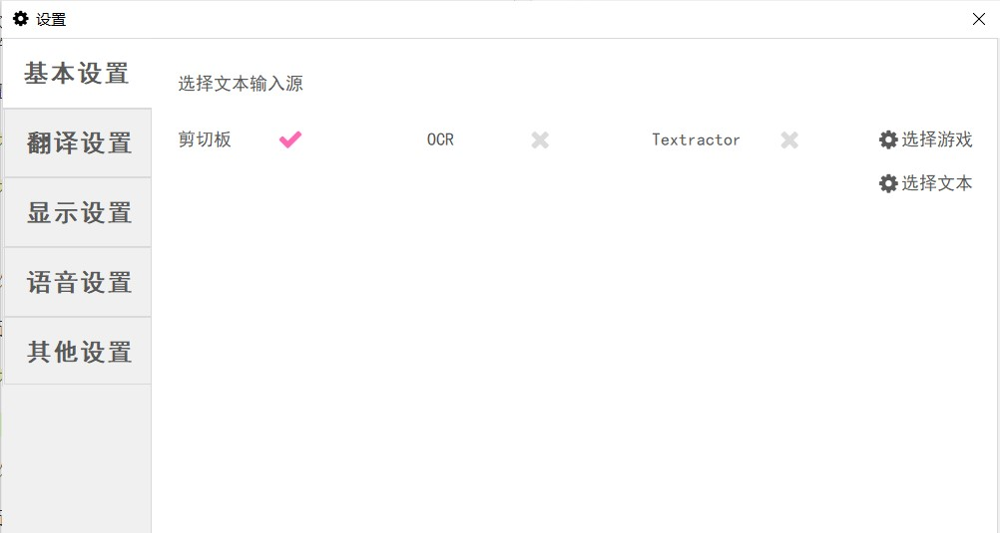

##### 翻译设置

一些翻译器的设置。不过作者比较懒就没有把各种类型的翻译器分开放。

其中：Jbeijing7是离线翻译；百度api和腾讯api是需要用户自行申请注册才能使用；（自建可以忽略，如果你是大佬的话可以自己部署本地翻译模型）

其余所有翻译器均可随意选择，数量也没有限制。

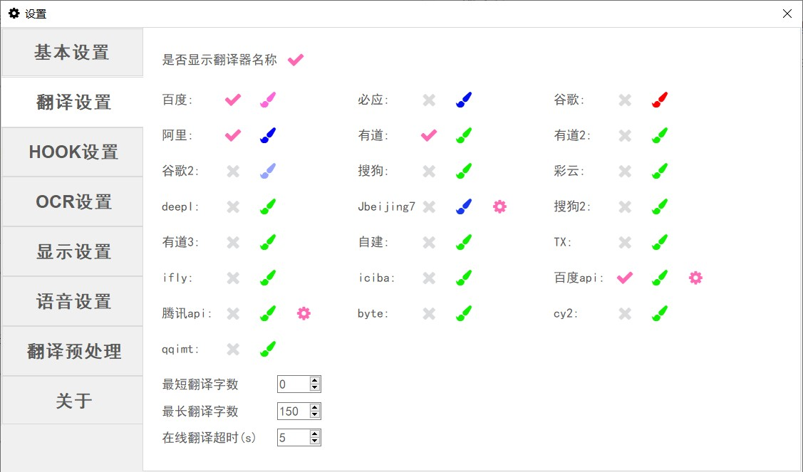

##### 显示设置

一些常见的显示设置，不再赘述

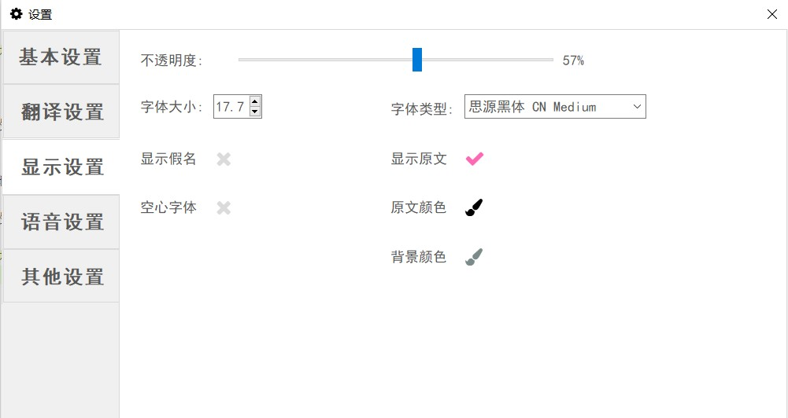

##### 语音设置

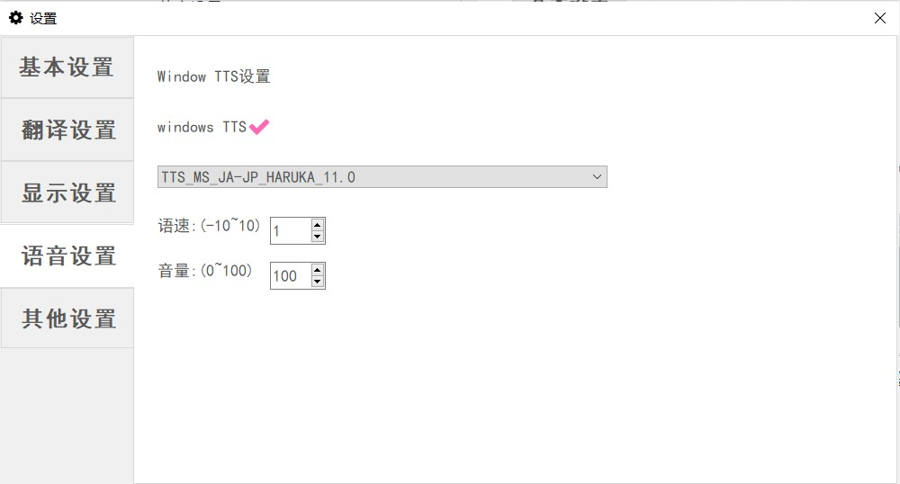

一般情况下可能只有两种语音（中文ZH-CN和英文EN-US），日文JA-JP需要在系统的语言设置里面安装支持。

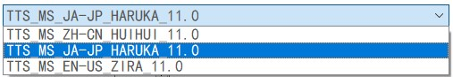 语音选择

##### 其他设置

一些其他设置。
目前只有这一点设置，即在HOOK模型下选取游戏后可以当游戏最小化/移动时，软件跟着一起最小化/移动。

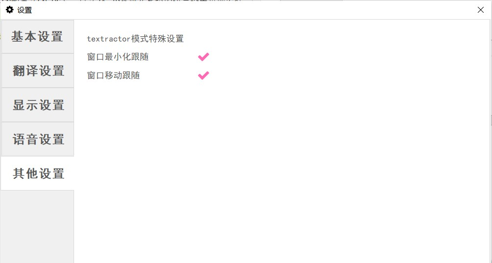

### OCR说明

软件自带OCR，不需要任何部署。使用时先在基本设置中选择OCR，然后在工具栏中选择选取OCR范围，然后即可进行自动识别翻译。
可以拖到和调整黑色范围框，或者重新选取来改变OCR范围。可以按下隐藏按钮隐藏范围框

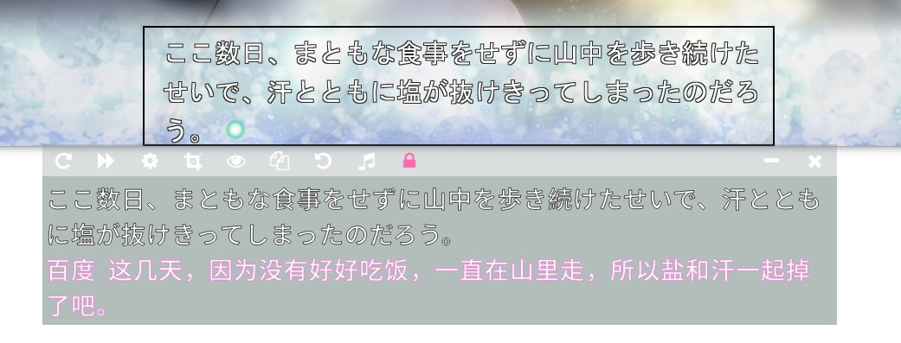

### HOOK说明

可以选择使用Textractor（HOOK）进行文本的提取，方法如下：

在基本设置界面选择Textractor，会自动弹出进程选择窗口。或自行点击“选择游戏”按钮，弹出进程选择窗口。

有两种方式选择进程：

* 点击“点此按钮后点击游戏窗口”按钮后，点击游戏窗口，会自动获取游戏进程

* 在下方的列表中选择游戏

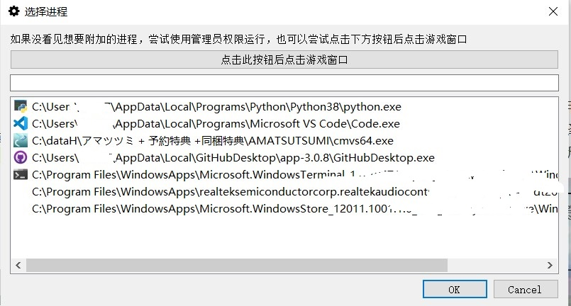 进程选择窗口

选择完毕后点击OK，然后会自动弹出文本选择窗口。

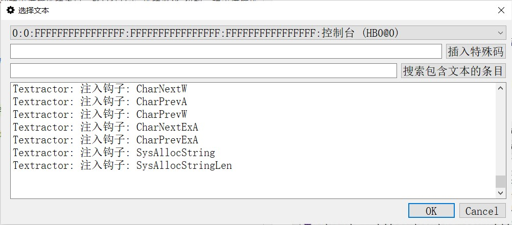 文本选择窗口

刚出现此窗口时，最上方的下来列表中还没有想要的条目。
在游戏里面让游戏显示下一句话，最上方的下拉列表中就会出现很多很多条目。

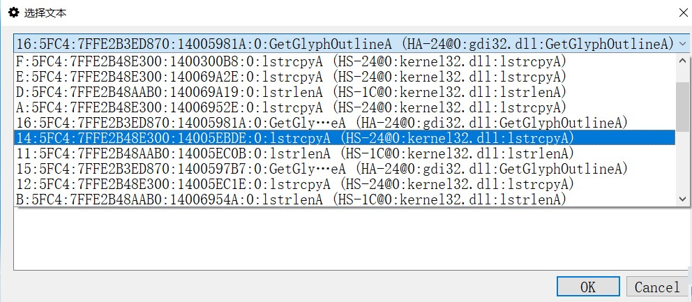  

选取条目后，文本选择窗口中的文本框就会显示这一条目捕捉到的文本。
列表中会有很多条目，可以在下拉列表中滚动鼠标滚轮快速切换条目来寻找所需要的条目，或者在下方的“搜索包含文本的条目”文本框中输入当前游戏窗口中的文字对条目进行筛选，就可以轻松找到所需的内容。

使用游戏中出现的“神”字进行搜索，列表中只剩下4个条目。

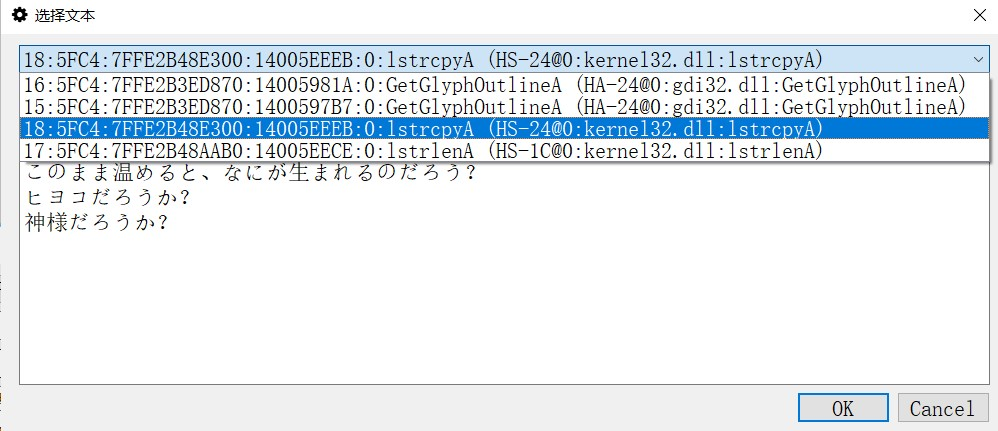 

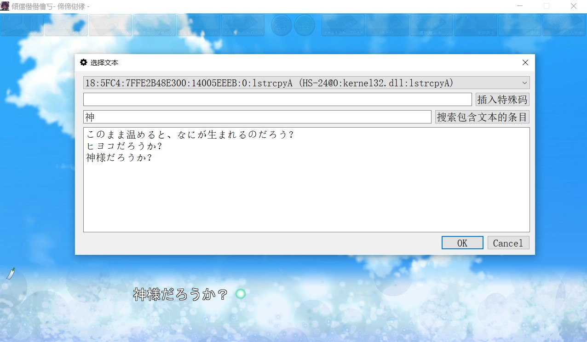 

然后选择OK，游戏就会开始翻译。如果后面发现选择的条目不符合要求，还可以自己在基本设置界面打卡选择文本按钮重新进行选择。

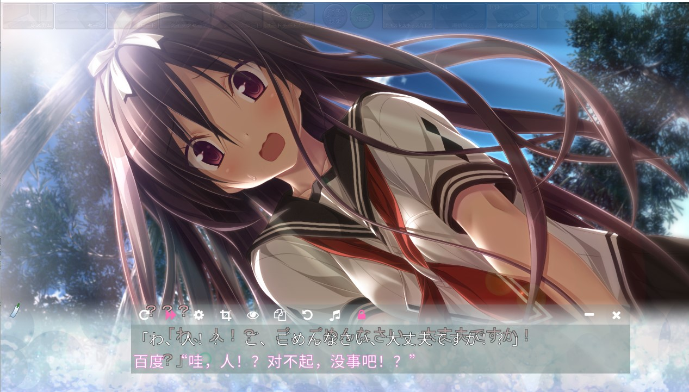 
