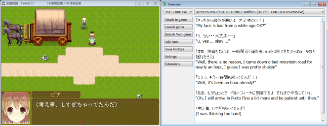

# Textractor

[English](README.md) ● [Español](README_ES.md) ● [简体中文](README_SC.md) ● [Русский](README_RU.md) ● [한국어](README_KR.md) ● [ภาษาไทย](README_TH.md) ● [Français](README_FR.md) ● [Italiano](README_IT.md) ● [日本語](README_JP.md) ● [Bahasa Indonesia](README_ID.md) ● [Português](README_PT.md)

**Textractor** (a.k.a. NextHooker) est un traducteur de jeux-videos basé surtout sur du texte en open source x86/x64 pour Windows/Wine [ITHVNR](https://web.archive.org/web/20160202084144/http://www.hongfire.com/forum/showthread.php/438331-ITHVNR-ITH-with-the-VNR-engine). 
Regarde le [tutorial video](docs/TUTORIAL.md) pour un aperçu rapide de son utilisation.

## Téléchargement

Les versions de Textractor peuvent être trouvées[here](https://github.com/Artikash/Textractor/releases). 
Le denière version de THVNR peut etre trouvé [here](https://drive.google.com/open?id=13aHF4uIXWn-3YML_k2YCDWhtGgn5-tnO).

## Nouveautés
- Hautement extensible et personnalisable
- Accrochage automatique de nombreux moteurs de jeu (dont certains non pris en charge par VNR!)
- Les textes de hook qui utilisent des /H "hook" codes (la plupart des codes AGTH pris en charge)
- Extraire directement le texte à l'aide des codes /R "lire"

## Support

Veuillez me signaler les bugs, les jeux dont Textractor a du mal à accrocher, les demandes de fonctionnalités ou d'autres suggestions.  
Si vous rencontrez des difficultés pour accrocher un jeu, veuillez m'envoyer un e-mail à un endroit où je peux le télécharger librement/gratuitement ou me le faire cadeau sur [Steam](https://steamcommunity.com/profiles/76561198097566313/).

## Extensions

Regarde mes [Example Extension project](https://github.com/Artikash/ExampleExtension) pour voir comment créer un extension. 
Voir le dossier des extensions pour des exemples de ce que les extensions peuvent faire. 

## Contribution

Toutes les contributions sont appréciées! Veuillez m'envoyer un e-mail À akashmozumdar@gmail.com si vous avez des questions sur la base de code.  
Vous devez utiliser le processus standard de création d'une demande d'extraction (fork, branch, commit changes, make PR from your branch to my master).  
Contribuer à une traduction est simple: il suffit de traduire les chaînes dans text.cpp ainsi que ce fichier README.

## Compilation 

Avant de compiler *Textractor*, vous devriez obtenir Visual Studio avec prise en charge de CMake, ainsi que Qt version 5.13  
Vous devriez ensuite pouvoir simplement ouvrir le dossier dans Visual Studio et faire le build. Exécutez Textractor.exe.

## Architecture du projet

L'hôte (voir GUI / dossier hôte) injecte texthook.dll (créé à partir du dossier texthook) dans le processus cible et s'y connecte via 2 fichiers pipe.  
L'hôte écrit dans hostPipe, texthook écrit dans hookPipe.  
Texthook attend que le canal soit connecté, puis injecte quelques instructions dans toutes les fonctions de sortie de texte (par exemple TextOut, GetGlyphOutline) qui provoquent l'envoi de leur entrée via le canal.  
Des informations supplémentaires sur les hooks sont échangées via la mémoire partagée.  
Le texte que l'hôte reçoit via le canal est ensuite traité un peu avant d'être renvoyé à l'interface graphique.  
Enfin, l'interface graphique envoie le texte aux extensions avant de l'afficher.

## [Développeurs](docs/CREDITS.md)